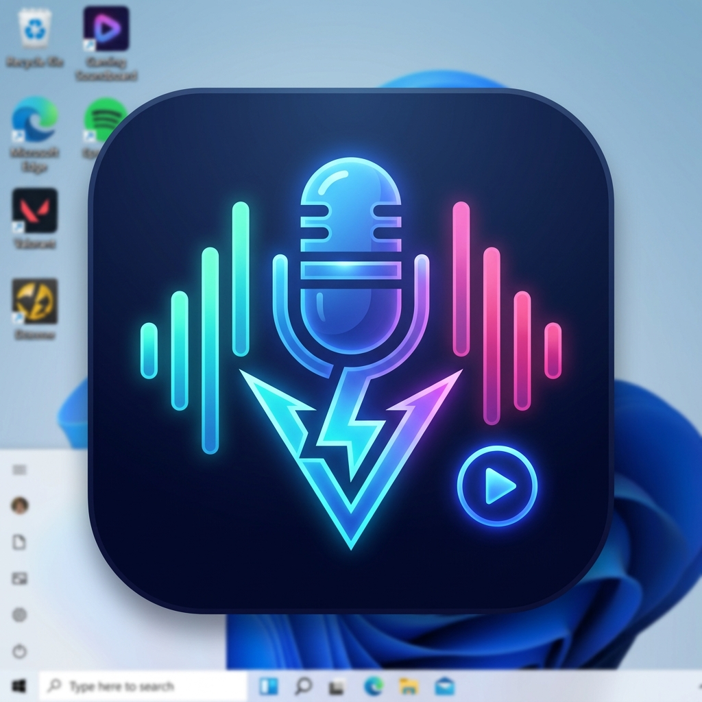

# SonicSurge 🎵

> **The ultimate gaming soundboard for Valorant & Discord**

A lightweight desktop soundboard built with Electron + React, designed for instant hotkey-triggered meme sounds through your microphone in voice chat applications.



---

## ✨ Features

| Feature | Description |
|---|---|
| 🎵 **Soundboard Grid** | Play sounds instantly via click or global hotkey |
| ⌨️ **Global Hotkeys** | Works even while Valorant/Discord is focused |
| 🎯 **PTT Sync** | Auto press/release your push-to-talk key |
| 🎙️ **Virtual Mic Routing** | Send sounds through your microphone |
| 📥 **YouTube Import** | Extract audio from YouTube/Instagram |
| ✂️ **Clip Trimming** | Set start/end timestamps before saving |
| ❤️ **Favorites** | Pin your most-used sounds |
| 🔊 **Per-Sound Volume** | Individual volume control per sound |

---

## 🛡️ Safety Notice

SonicSurge is a **safe, standard Windows desktop application**:

- ✅ Does NOT inject into Valorant or any game
- ✅ Does NOT modify game files
- ✅ Does NOT interact with Riot Vanguard anti-cheat
- ✅ PTT simulation uses the standard **Windows SendInput API** (same as a keyboard)
- ✅ Audio routing uses standard **Windows audio devices** only

---

## 🚀 Quick Start

### Development
```bash
npm install
npm run dev
```

### Build installer
```bash
npm run dist
```

### Run unpacked (faster)
```bash
npm run dist:dir
# Then run: dist-electron/win-unpacked/SonicSurge.exe
```

---

## 📦 Requirements

- **Windows 10/11 x64**
- **Node.js 18+** (for building)
- **yt-dlp** (for YouTube import): `winget install yt-dlp`
- **VB-CABLE** or **Voicemeeter** (for mic routing): [vb-audio.com](https://vb-audio.com/Cable/)

---

## 🎙️ Virtual Mic Setup

1. Install [VB-CABLE](https://vb-audio.com/Cable/) or [Voicemeeter](https://vb-audio.com/Voicemeeter/)
2. In SonicSurge Settings → Virtual Audio Pipeline → **Create Pipeline**
3. In Discord: Microphone → `CABLE Output (VB-Audio Virtual Cable)`
4. Enable **Play Through Mic** in SonicSurge

---

## Tech Stack

- **Electron** — Desktop framework
- **React** — UI
- **Zustand** — State management
- **yt-dlp + FFmpeg** — Audio extraction
- **electron-builder** — Installer/EXE generation

---

## License

MIT © 2025 SonicSurge
